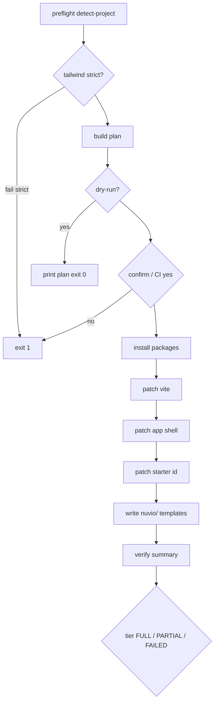

# Nuvio v0.5.1 — CLI onboarding (`@nuvio/cli`)

**Document status:** **Implemented in monorepo** — pending manual S8b sign-off, npm publish, and `v0.5.1` tag  
**Release target:** all public `@nuvio/*` at **0.5.1** on npm (see §3 publish matrix; excludes `@nuvio/next`)  
**Audience:** Implementers (Cursor/ChatGPT agents: follow §3–§13, §23–§25; do not modify locked packages per §2)

> **Note:** If you have additional ChatGPT recommendation text not reflected here, paste it into §24 feedback table before coding.

**Prerequisites**

- v0.5.0 stable shipped per [`nuvio_v0.5.0.md`](nuvio_v0.5.0.md) §18.2 (`@nuvio/vite-plugin`, `@nuvio/overlay`, `@nuvio/shared`, `@nuvio/ast-engine` at `0.5.0` on npm)
- `pnpm dogfood` green on main
- No changes required to overlay Simple Mode, patch engine, vite-plugin protocol, ast-engine, or index v4 for this release

**Companions**

| Doc | Role |
| --- | --- |
| [`nuvio_v0.5.0.md`](nuvio_v0.5.0.md) | **Baseline** — editor UX, task router, instrumentation contracts (unchanged in 0.5.1) |
| [`nuvioUser.md`](nuvioUser.md) | Public guide — **Quick Start** leads with CLI after 0.5.1 |
| [`DOGFOOD.md`](DOGFOOD.md) | Manual + automated sign-off for S8b |
| [`COMPATIBILITY.md`](COMPATIBILITY.md) | Still Vite + React + Tailwind public matrix |
| [`README.md`](../README.md) | Root install story — lead with `nuvio init` |

**Implementation note**

> v0.5.1 is an **onboarding automation release**, not an editor or engine release.  
> Goal: a vibe coder reaches **first successful Preview → Apply** without reading [`nuvioUser.md`](nuvioUser.md).  
> Full dashboard instrumentation (cards, tables, nav) remains manual or agent-driven via `nuvio/AGENT.md`.

**Relationship to prior discussion**

This spec merges:

1. ChatGPT’s `@nuvio/cli` implementation prompt (install, wire, mount, one starter id, `nuvio/` folder).
2. Review feedback: **do not label this as retroactive v0.5.0**; enforce/warn Tailwind; **AST-based** patches; **version-couple** installed packages to CLI version; refine starter-id idempotency; add **S8b** acceptance.

---

## Table of contents

1. [Release positioning](#0-release-positioning)
2. [North star & user flow](#1-north-star--user-flow)
3. [Scope matrix](#2-scope-matrix)
4. [Package: `@nuvio/cli`](#3-package-nuviocli)
5. [Project detection](#4-project-detection)
6. [Package manager detection](#5-package-manager-detection)
7. [Install step](#6-install-step)
8. [Patch Vite config](#7-patch-vite-config)
9. [Patch app root](#8-patch-app-root)
10. [Starter `data-nuvio-id`](#9-starter-data-nuvio-id)
11. [`nuvio/` project folder](#10-nuvio-project-folder)
12. [CLI options & safety](#11-cli-options--safety)
13. [Success output](#12-success-output)
14. [Tests](#13-tests)
15. [Documentation updates](#14-documentation-updates)
16. [Acceptance scenarios](#15-acceptance-scenarios)
17. [Implementation sequence](#16-implementation-sequence)
18. [Definition of done](#17-definition-of-done)
19. [Package touchpoints](#18-package-touchpoints)
20. [Risk register](#19-risk-register)
21. [Explicit deferrals](#20-explicit-deferrals)
22. [Promotion & distribution (brief)](#21-promotion--distribution-brief)
23. [Locked decisions (was: open questions)](#23-locked-decisions-was-open-questions)
24. [Init orchestration](#24-init-orchestration)
25. [AST transform rules](#25-ast-transform-rules)
26. [File templates (verbatim)](#26-file-templates-verbatim)
27. [Appendix — ChatGPT spec deltas](#27-appendix--chatgpt-spec-deltas)
28. [Second-pass recommendation log](#28-second-pass-recommendation-log)

---

# 0. Release positioning

## Product statement

v0.5.0 proved the vibe-coder loop in the editor. v0.5.1 removes setup friction so adoption can be sold as **two commands**, not four manual doc steps.

## Public promise (0.5.1)

```text
pnpm dlx @nuvio/cli init
pnpm dev
→ Edit on → click starter element → Preview Changes → Apply to Code
```

Manual setup in [`nuvioUser.md`](nuvioUser.md) remains for existing apps, partial wiring, TailAdmin-scale instrumentation, and agent handoff.

## What 0.5.1 is not

- Not full-app instrumentation (no mass `data-nuvio-id`).
- Not click-to-tag in the browser (deferred).
- Not Next.js init (Vite-only).
- Not a change to Simple Mode, task router, or patch protocol.

---

# 1. North star & user flow

## Target user

Vibe coder with an **existing** or **new** Vite + React + Tailwind app who will not read a 400-line guide for first success.

## Target flow

```bash
cd my-app
pnpm dlx @nuvio/cli init    # or: npx @nuvio/cli init
pnpm dev
```

Browser:

1. Open localhost URL from Vite.
2. Nuvio chip → **Edit** on.
3. Click the **starter** editable element (default id `page.title` on first heading).
4. Change text → **Preview Changes** → **Apply to Code**.

**Success metric (S8b):** fresh `create vite` app + `nuvio init --yes` → first apply in **under 10 minutes** without opening `nuvioUser.md`.

## S8 vs S8b

| Scenario | Path | Doc |
| -------- | ---- | --- |
| **S8** (0.5.0 stable) | Monorepo `demo-app` or manual `nuvioUser.md` | [`nuvio_v0.5.0.md`](nuvio_v0.5.0.md) §14 |
| **S8b** (0.5.1) | External temp Vite app + CLI only | This doc §15 |

S8 remains valid; S8b is the new primary external onboarding story after 0.5.1 ships.

---

# 2. Scope matrix

| Area | In 0.5.1 | Out of 0.5.1 |
| ---- | -------- | -------------- |
| New package `packages/cli` → `@nuvio/cli` | ✅ | |
| `nuvio init` command | ✅ | |
| Detect React + Vite (+ Tailwind warn/gate) | ✅ | |
| Install `@nuvio/vite-plugin` + `@nuvio/overlay` (devDeps) | ✅ | |
| Patch `vite.config.*` — add `nuvio()` | ✅ | |
| Patch app root — `<NuvioDevShell />` | ✅ | |
| One starter `data-nuvio-id="page.title"` | ✅ | |
| Create `nuvio/START_HERE.md`, `nuvio/README.md` (pointer), `nuvio/AGENT.md` | ✅ | |
| Conditional `nuvio/SETUP_TODO.md` on patch failure | ✅ | |
| Unit tests + fixtures | ✅ | |
| Docs: Quick Start in `nuvioUser.md`, README | ✅ | |
| CI script `pnpm v051:acceptance` | ✅ **required** for DoD | |
| Post-init verification summary (inline) | ✅ | Separate `nuvio doctor` command |
| `nuvio doctor` (read-only) | | v0.5.2 |
| Overlay chip “run init” when 0 ids | | **Not in 0.5.1** (ChatGPT #4 — locked overlay; defer 0.5.2) |
| Click-to-assign ids in dev | | v0.6+ |
| `create-vite` official template with Nuvio | | v0.6+ (optional) |
| Init for Next.js / Remix | | v0.6+ |
| Auto card/table/nav instrumentation | | Never in init |

---

# 3. Package: `@nuvio/cli`

## Location

```
packages/cli/
  package.json          # name: @nuvio/cli, version: 0.5.1
  templates/            # shipped verbatim; copied to user nuvio/
    START_HERE.md.tpl
    README.pointer.md.tpl
    AGENT.md.tpl
    SETUP_TODO.md.tpl
  src/
    cli.ts              # entry, argv parsing
    init.ts             # orchestration (see §24)
    detect-project.ts
    detect-pm.ts
    install-packages.ts
    patch-vite-config.ts
    patch-app-root.ts
    patch-starter-id.ts
    scan-ids.ts         # bounded src scan for page.title
    write-nuvio-folder.ts
    verify.ts           # post-init checks (inline “doctor”)
    plan.ts             # in-memory change plan
    messages.ts         # plain-language errors (no stack traces to users)
    version.ts          # NUVIO_VERSION from package.json at build
  test/
    fixtures/           # minimal vite apps per shape
    *.test.ts
```

**Build toolchain:** match sibling packages — `tsup` for `dist/`, `vitest run` for tests, `typecheck` via `tsc`.

## `package.json` requirements

| Field | Value |
| ----- | ----- |
| `name` | `@nuvio/cli` |
| `version` | `0.5.1` (semver with published `@nuvio/*`) |
| `bin` | `{ "nuvio": "./dist/cli.js" }` |
| `files` | `dist`, `templates` (if any) |
| `engines.node` | `>=20` |
| `dependencies` | Minimal — prefer `@babel/parser`, `@babel/traverse`, `recast` (or equivalent) for transforms; **do not** depend on `@nuvio/ast-engine` at runtime (keeps `dlx` lean) |
| `type` | Align with other packages (ESM + `#!/usr/bin/env node`) |

## Command surface

```bash
nuvio init [options]
```

Invoked as:

```bash
pnpm dlx @nuvio/cli init
npx @nuvio/cli init
```

No other subcommands in 0.5.1 (`nuvio doctor` deferred to v0.5.2; init prints inline verification per §24).

## Version coupling (critical) — locked in §23

When installing, pin **exactly**:

- `@nuvio/vite-plugin@<NUVIO_VERSION>`
- `@nuvio/overlay@<NUVIO_VERSION>`

`NUVIO_VERSION` is read from `@nuvio/cli` `package.json` at build time (`src/version.ts`).

**Do not** hardcode semver in source. **Do not** install `@nuvio/shared` or `@nuvio/ast-engine` via init (transitive deps of vite-plugin/overlay).

## npm publish matrix (0.5.1) — ChatGPT #2

**Bump all public packages to `0.5.1` together** on npm, even if `shared` / `ast-engine` have no code changes. Avoid `@nuvio/cli@0.5.1` installing `@nuvio/overlay@0.5.0` — version mismatch confuses users and agents.

| Package | Publish `0.5.1`? |
| ------- | ---------------- |
| `@nuvio/cli` | **Yes** (new) |
| `@nuvio/vite-plugin` | **Yes** |
| `@nuvio/overlay` | **Yes** |
| `@nuvio/shared` | **Yes** (version bump only if needed) |
| `@nuvio/ast-engine` | **Yes** (version bump only if needed) |
| `@nuvio/next` | **No** (still excluded from stable publish) |

Monorepo: set `version: "0.5.1"` in all five `package.json` files above before publish.

```bash
pnpm add -D @nuvio/vite-plugin@0.5.1 @nuvio/overlay@0.5.1
```

(`shared` / `ast-engine` are transitive; init does not add them directly.)

## Monorepo integration

- Add `packages/cli` to `pnpm-workspace.yaml` (already covered by `packages/*`).
- Root `package.json` scripts (suggested):
  - `"test:cli": "pnpm --filter @nuvio/cli test"`
  - `"v051:acceptance": "node scripts/v051-cli-acceptance.mjs"` (see §15)
- `publish:stable`: include `@nuvio/cli`; continue excluding `@nuvio/next` (use zsh-safe `'!@nuvio/next'` filter).

---

# 4. Project detection

Run from **project root** (directory containing target `package.json` and Vite config). User may run from `apps/my-app` in a monorepo — that subfolder is the root for detection.

## Required checks

| Check | Pass | Fail message (plain, exit code 1) |
| ----- | ---- | --------------------------------- |
| `package.json` exists | continue | `Run this from your app folder (the one with package.json).` |
| Vite config exists | continue | `Nuvio works with React + Vite projects. I couldn't find a Vite config here.` |
| `react` in `dependencies` or `devDependencies` | continue | `Nuvio needs React. Add react to this project first.` |
| `vite` in `dependencies` or `devDependencies` | continue | `Nuvio needs Vite. Add vite to this project first.` |

## Vite config filenames (any one)

- `vite.config.ts`
- `vite.config.js`
- `vite.config.mts`
- `vite.config.mjs`

## Tailwind check

Pass if **any** of:

- `tailwindcss` in `dependencies` or `devDependencies`, or
- `src/index.css` or `src/App.css` contains `@tailwind` or `@import "tailwindcss"` (read first matching file only).

| Result | Behavior |
| ------ | -------- |
| Pass | Continue silently |
| Fail | **Warn** and continue (ChatGPT #3 — do not block early onboarding; user may add Tailwind right after Vite setup) |
| `--strict` | Exit 1: `Nuvio expects Tailwind CSS for class edits. Install tailwindcss or pass --skip-tailwind-check.` |

`--skip-tailwind-check` skips warn and strict. Mention Tailwind in `nuvio/START_HERE.md` when warn fired.

## Monorepo / self-target guards

| Condition | Behavior |
| --------- | -------- |
| `package.json` `name` is `nuvio` and `"private": true` at repo root | Warn: `This looks like the Nuvio monorepo. Run init in your app folder, not the tooling repo.` Exit 1 unless `--yes` and user confirms in plan (discourage). |
| `package.json` `name` is `@nuvio/cli` | Exit 1: `Cannot init inside @nuvio/cli package.` |

## Error handling

- Never print Node stack traces to end users for expected failures.
- Log stacks only when `NUVIO_CLI_DEBUG=1` or `--verbose`.

---

# 5. Package manager detection

## Lockfile precedence

| Lockfile | PM |
| -------- | -- |
| `pnpm-lock.yaml` | `pnpm` |
| `package-lock.json` | `npm` |
| `yarn.lock` | `yarn` |
| `bun.lockb` or `bun.lock` | `bun` |
| (none) | `npm` (fallback) |

## Override

`--pm pnpm|npm|yarn|bun` forces install command.

## Install command shapes

```bash
pnpm add -D @nuvio/vite-plugin@<ver> @nuvio/overlay@<ver>
npm install -D @nuvio/vite-plugin@<ver> @nuvio/overlay@<ver>
yarn add -D @nuvio/vite-plugin@<ver> @nuvio/overlay@<ver>
bun add -d @nuvio/vite-plugin@<ver> @nuvio/overlay@<ver>
```

Skip when `--no-install` (for tests / dry plan only).

---

# 6. Install step

1. If not `--no-install`, run detected PM add command with coupled version (§3).
2. On install failure, print plain message + suggest manual command; exit 1.
3. Idempotent: if both packages already in `devDependencies` at **compatible** version, skip install (log `already installed`).

**Compatible version:** installed version matches `NUVIO_VERSION` **exactly**, OR installed is `0.5.0` while CLI is `0.5.1` → **upgrade** install (re-run add with pinned `0.5.1`).

4. Spawn install with `stdio: "inherit"` so users see PM output; on failure suggest the exact command string printed.

---

# 7. Patch Vite config

## Goal

Add:

```ts
import { nuvio } from "@nuvio/vite-plugin";
```

And `nuvio()` to the `plugins` array passed to `defineConfig`.

## Implementation

- **Use AST** (`@babel/parser` + `recast` or `@babel/generator`), not regex-only substitution.
- Detect existing `nuvio` import or `nuvio()` call → skip (idempotent).
- Handle common shapes:
  - `plugins: [react()]`
  - `plugins: [react(), other()]`
  - multiline `plugins: [\n  react(),\n]`
- Do **not** duplicate `nuvio()` if already present.

## Optional (nice-to-have)

If `resolve.dedupe` missing, add:

```ts
resolve: { dedupe: ["react", "react-dom"] },
```

Only when safe; skip if `resolve` block is non-trivial.

## Failure

If config uses dynamic plugin spreads, re-exports, or non-standard structure:

1. Do **not** half-patch.
2. Write `nuvio/SETUP_TODO.md` with manual snippet (full `vite.config.ts` example from [`nuvioUser.md`](nuvioUser.md) Step 2).
3. Print: `I couldn't safely update vite.config.ts. See nuvio/SETUP_TODO.md`
4. Exit non-zero **only if** vite patch was required for “full success”; define orchestration: **partial success** = installed + TODO file (document in §12).

**Orchestration (locked):** vite patch failure → **warning + SETUP_TODO**, **continue** app patch and starter id when possible. See §12 exit codes.

**Unsupported without SETUP_TODO:** config file re-exports another file as sole export; `plugins` is not an array literal (e.g. spread-only dynamic list with no static array to append to). See §25.

---

# 8. Patch app root

## Candidate files (priority order)

1. `src/App.tsx`
2. `src/App.jsx`
3. `src/main.tsx` (only if App not found or App has no JSX return)
4. `src/main.jsx`

Prefer **App** over **main** when both exist.

## Goal

Add:

```tsx
import { NuvioDevShell } from "@nuvio/overlay";
```

Render `<NuvioDevShell />` **once** inside the root component’s returned JSX.

## Insertion rules

- If return is `<>...</>` or `<div>...</div>`, insert before closing tag (typically end of fragment).
- If return is single element, wrap or use fragment — prefer minimal diff.
- Idempotent: skip if import and JSX already exist (AST match).

## Failure

Same as Vite: `nuvio/SETUP_TODO.md` with Step 3 snippet; plain message.

## Re-export / thin `App.tsx`

If `App.tsx` only re-exports from `./pages/Home`, follow re-export to the file that contains JSX `return`. If unresolvable statically, SETUP_TODO only (do not guess).

---

# 9. Starter `data-nuvio-id`

## Default id

`data-nuvio-id="page.title"`

## Where to add

Search for first heading in **patch target file** first, then optionally:

- `src/App.tsx` / `src/App.jsx`
- `src/pages/**/*.{tsx,jsx}` (first file with `<h1>` or `<h2>`)

Prefer `<h1>`, then `<h2>`.

## Idempotency rule (refined from review)

| Condition | Action |
| --------- | ------ |
| `page.title` already exists anywhere under `src/**/*.{tsx,jsx}` | Skip add; log “starter id already present” |
| Any other `data-nuvio-id` exists but not `page.title` | **Still add** `page.title` to first heading (ChatGPT said skip if any id — **rejected**; causes 0 clickable starter on home) |
| No heading in searched files | Skip add; success message includes warning (§12) |

## Constraints

- Attribute must be **string literal** on the JSX opening tag (AST).
- Do not mass-scan/instrument the whole tree.
- Do not modify `className` unless required for valid JSX.

## Warning copy (no heading)

```text
Nuvio is wired, but I couldn't find a heading to mark editable.
Add data-nuvio-id="page.title" to one visible element (see nuvio/START_HERE.md).
```

---

# 10. `nuvio/` project folder

Created at project root: `./nuvio/`

## Always write

Copy from `packages/cli/templates/*.tpl` with token substitution (`{{PM_RUN}}`, `{{NUVIO_VERSION}}`).

### Template version stamp (required)

First line of generated `nuvio/START_HERE.md` and `nuvio/AGENT.md`:

```html
<!-- nuvio-cli-template: 1 -->
```

On re-init: if stamp matches and file content unchanged vs template, skip overwrite (except `--force-agent` for AGENT). Bump template id in CLI when copy changes.

### `nuvio/START_HERE.md` (primary — ChatGPT product tweak)

Vibe coders and agents spot **START_HERE** faster than another README. Use §26 `START_HERE.md.tpl`. Substitute detected PM (`pnpm dev` / `npm run dev` / etc.).

### `nuvio/README.md` (pointer only)

Always write a **short** pointer so tools that open `README.md` by habit still land correctly:

```markdown
<!-- nuvio-cli-template: 1 -->
# Nuvio

**Start here:** [START_HERE.md](./START_HERE.md)

Agent instructions: [AGENT.md](./AGENT.md)
```

Use `README.pointer.md.tpl` from §26.

### `nuvio/AGENT.md`

Use §26 verbatim template. **Do not** link to monorepo paths; agent may use user’s `nuvioUser.md` if they add it.

## Conditional

### `nuvio/SETUP_TODO.md`

Written when Vite or App patch failed. Contains exact manual snippets + file paths attempted.

## Idempotency

| File | Second `init` run |
| ---- | ----------------- |
| `START_HERE.md` | Skip if template stamp + content matches; else write |
| `README.md` | Always refresh pointer (tiny file) or skip if identical to template |
| `AGENT.md` | **Do not overwrite** without `--force-agent` or confirmation prompt |
| `SETUP_TODO.md` | Append or replace only if new failures |

Default interactive init: if `nuvio/AGENT.md` exists, skip with message unless `--force-agent`.

---

# 11. CLI options & safety

## Options

| Flag | Description |
| ---- | ----------- |
| `--yes` | Skip confirmation prompt |
| `--no-install` | Plan + patch files only; do not run PM install |
| `--dry-run` | Print plan only; no writes |
| `--pm <name>` | Force package manager |
| `--strict` | Fail if Tailwind not found |
| `--skip-tailwind-check` | Skip Tailwind warn |
| `--force-agent` | Overwrite `nuvio/AGENT.md` |
| `--verbose` | Debug logging |
| `--cwd <path>` | Run as if started in `<path>` (must contain `package.json`) |

## Non-interactive defaults

| Environment | Behavior |
| ----------- | -------- |
| `CI=true` or non-TTY stdin | Treat as `--yes` (skip confirm prompt) |
| Local TTY | Confirm unless `--yes` |

## Confirmation flow (default)

1. Build in-memory **plan**: list files to create/modify.
2. Print plan to stdout.
3. Prompt: `Proceed? [y/N]` unless `--yes`.

## Dry run

Print plan with `would modify:` / `would create:` — exit 0.

---

# 12. Success output

## Full success example

```text
✅ Nuvio installed (@nuvio/vite-plugin@0.5.1, @nuvio/overlay@0.5.1)
✅ Vite plugin added (vite.config.ts)
✅ Nuvio editor mounted (src/App.tsx)
✅ Starter editable area: page.title (src/App.tsx)
✅ Start here: nuvio/START_HERE.md
✅ Agent guide: nuvio/AGENT.md

Next:
  pnpm dev

Open localhost → Edit on → click the page title (or starter element).
```

## Result tiers (ChatGPT #1)

| Tier | Meaning | Exit code |
| ---- | ------- | --------- |
| **FULL** | Install OK + vite OK + app OK + starter id OK | 0 |
| **PARTIAL** | Install OK + at least app shell OK; vite and/or starter id failed → `SETUP_TODO.md` | **0** + warnings |
| **FAILED** | Preflight failed, user declined, install failed, or app shell not mounted | **1** |
| **ERROR** | Unexpected throw | 2 (`--verbose` shows stack) |

**Product copy for PARTIAL:** end with something like: *“Nuvio set up what it could safely. Finish the steps in nuvio/SETUP_TODO.md, then run pnpm dev.”*

**Locked:** when `SETUP_TODO.md` is generated, **exit 0** — not 1. Reserve **exit 1** for preflight failure or user decline (and hard install/shell failure). Vibe-coder framing: **“Nuvio helped you as far as it safely could.”**

## Post-init verification (inline, not `doctor`)

After writes, print:

```text
Verification:
  devDependencies: @nuvio/vite-plugin, @nuvio/overlay — OK | MISSING
  vite.config: nuvio() — OK | TODO
  App shell: NuvioDevShell — OK | TODO
  Starter id page.title — OK | MISSING (add manually)
```

## Exit codes

| Code | Meaning |
| ---- | ------- |
| 0 | FULL or PARTIAL |
| 1 | FAILED (preflight, declined, install, or no app shell) |
| 2 | ERROR |

---

# 13. Tests

Framework: align with monorepo (Vitest or Node test runner used elsewhere).

## Fixture layout

```
packages/cli/test/fixtures/
  vite-react-ts-minimal/     # happy path
  vite-already-nuvio/      # idempotency
  vite-complex-plugins/    # fallback SETUP_TODO
  vite-no-heading/         # warning path
  vite-no-tailwind/        # warn / --strict
```

## Required test cases

| # | Test |
| - | ---- |
| T1 | Package manager detection from lockfiles |
| T2 | Vite config patch — adds import + `nuvio()` |
| T3 | Vite config idempotency — second run unchanged |
| T4 | App.tsx patch — import + `<NuvioDevShell />` |
| T5 | App idempotency |
| T6 | Starter id — adds `page.title` on h1 |
| T7 | Starter id skip when `page.title` exists |
| T8 | Dry run — no file changes |
| T9 | `--no-install` — no spawn install |
| T10 | Fallback — complex vite → SETUP_TODO created |
| T11 | Plan output lists correct files |
| T12 | `CI=true` skips confirmation |
| T13 | Monorepo root guard |
| T14 | Tailwind detect via CSS `@import "tailwindcss"` |
| T15 | Post-init verification output |

Run in CI: `pnpm --filter @nuvio/cli test` and `pnpm v051:acceptance`.

---

# 14. Documentation updates

## [`nuvioUser.md`](nuvioUser.md)

Restructure top:

```markdown
## Quick Start

pnpm dlx @nuvio/cli init
pnpm dev

Then: Edit on → click starter element → Preview Changes → Apply to Code.

## Manual setup

(existing Steps 1–5, card/table/nav patterns, troubleshooting)
```

Update npm pin examples to **0.5.1** where pinned; add CLI as primary path for new projects.

## [`README.md`](../README.md)

- “Install in your project” → lead with `pnpm dlx @nuvio/cli init`.
- Manual 3-step wiring as secondary.

## `packages/cli/README.md`

Published to npm: usage, flags, exit codes, partial success, version coupling.

## [`CHANGELOG.md`](../CHANGELOG.md)

```markdown
## [0.5.1] - YYYY-MM-DD
### Added
- @nuvio/cli with `nuvio init` for Vite + React + Tailwind onboarding
```

## [`DOGFOOD.md`](DOGFOOD.md)

New subsection **v0.5.1** with S8b checklist.

## [`nuvio_v0.5.0.md`](nuvio_v0.5.0.md)

Add one line under §13 Setup: “Automated setup: see [`nuvio_v0.5.1.md`](nuvio_v0.5.1.md).” (optional cross-link)

## npm org page

Ensure `@nuvio/cli` appears on https://www.npmjs.com/org/nuvio

---

# 15. Acceptance scenarios

## S8b — CLI 10-minute path (required for 0.5.1 stable)

**Profile:** New user, no `nuvioUser.md`, Developer Details off.

**Setup (automatable):**

```bash
pnpm create vite nuvio-s8b-test --template react-ts
cd nuvio-s8b-test
pnpm install
pnpm add -D tailwindcss@3 postcss autoprefixer
npx tailwindcss init -p
# configure tailwind per vite template docs
pnpm dlx @nuvio/cli@0.5.1 init --yes
pnpm dev
```

**Pass:**

1. Chip shows index **≥ 1** id (or `page.title` indexed).
2. Click starter → edit text → **Preview Changes** → **Apply to Code** → HMR / file updates.

Record in [`DOGFOOD.md`](DOGFOOD.md).

## Required CI: `scripts/v051-cli-acceptance.mjs`

**Gate for §17 DoD.** Script must:

1. Build `@nuvio/cli` from workspace (`pnpm --filter @nuvio/cli build`).
2. Copy or link CLI into temp project, run `node path/to/cli.js init --yes --no-install` on fixture `vite-react-ts-minimal` **or** run full flow with install in isolated temp dir.
3. Assert files contain `nuvio()`, `NuvioDevShell`, `page.title`, `nuvio/AGENT.md`.
4. Run second init → assert idempotent (git diff empty on second run).
5. Exit 0.

Playwright apply loop optional; manual S8b still required once before npm publish.

## Regression

- `pnpm dogfood` unchanged (no overlay changes).
- `pnpm v05:acceptance:stable` still passes on main (dogfood/demo paths).

---

# 16. Implementation sequence

| Step | Work | Est. |
| ---- | ---- | ---- |
| 1 | Scaffold `packages/cli`, bin, build, publish config | 0.5d |
| 2 | `detect-project`, `detect-pm`, messages, `--dry-run` / `--yes` | 0.5d |
| 3 | `install-packages` + version constant | 0.25d |
| 4 | AST patch Vite + fixtures T2–T3, T10 | 1d |
| 5 | AST patch App + fixtures T4–T5 | 0.75d |
| 6 | Starter id patch + scan + T6–T7 | 0.5d |
| 7 | `write-nuvio-folder` + idempotency rules | 0.25d |
| 8 | Integration tests + `scripts/v051-cli-acceptance.mjs` | 0.5d |
| 9 | Docs + CHANGELOG + DOGFOOD S8b | 0.5d |
| 10 | Bump **all** public packages to `0.5.1`, publish, manual S8b | 0.25d |

**Total:** ~4–5 days focused.

**Implementation lock:** `packages/cli` is **not** locked. Do **not** modify locked overlay/vite-plugin/ast-engine/shared **behavior** (ChatGPT #4: no 0-ids CTA). Version bumps in `package.json` only for aligned `0.5.1` publish.

---

# 17. Definition of done

### 17.1 Engineering

- [ ] `@nuvio/cli@0.5.1` on npm with `nuvio` bin
- [x] `nuvio init` passes T1–T15 in CI (`pnpm --filter @nuvio/cli test`)
- [x] `pnpm v051:acceptance` green
- [ ] All public `@nuvio/*` at `0.5.1` on npm; init installs vite-plugin + overlay at `NUVIO_VERSION`
- [x] Idempotent second run (no duplicate imports/plugin/shell/id)
- [x] User-facing errors are plain language
- [x] `pnpm dogfood` green (no regressions)

### 17.2 Product / docs

- [x] [`nuvioUser.md`](nuvioUser.md) Quick Start + Manual setup split
- [x] [`README.md`](../README.md) leads with CLI
- [x] S8b signed in [`DOGFOOD.md`](DOGFOOD.md)
- [x] [`CHANGELOG.md`](../CHANGELOG.md) 0.5.1 entry

### 17.3 Explicitly NOT required

- Overlay “0 ids → run init” CTA (ChatGPT #4 — correctly deferred)
- `create-vite` upstream template PR
- Full TailAdmin init
- Marketing videos (reuse v0.5 scripts; new 20s GIF of init flow optional)

---

# 18. Package touchpoints

| Package / path | 0.5.1 changes |
| -------------- | ------------- |
| `packages/cli` | **New** — entire package |
| `packages/overlay` | **No change** (optional CTA deferred) |
| `packages/vite-plugin` | **No change** |
| `packages/shared` | **Version bump** to `0.5.1` only (publish with release) |
| `packages/ast-engine` | **Version bump** to `0.5.1` only |
| `apps/*` | **No change** unless adding CLI smoke fixture app (optional, prefer `test/fixtures`) |
| `docs/nuvioUser.md` | Quick Start |
| `docs/DOGFOOD.md` | S8b |
| `scripts/v051-cli-acceptance.mjs` | **Required** new |
| Root `package.json` | `test:cli`, publish filter includes cli |

---

# 19. Risk register

| Risk | Mitigation |
| ---- | ---------- |
| Vite config patch breaks exotic setups | AST + fail to SETUP_TODO; never half-patch |
| Starter id on wrong file / no heading | Search pages; clear warning; README in `nuvio/` |
| User runs init outside app root | Clear `package.json` message |
| `dlx` pulls huge dependency tree | Keep CLI deps minimal |
| Version drift CLI vs packages | Single version constant; publish together |
| Init on non-Tailwind app | Warn/`--strict`; document in README |
| Agents overwrite `AGENT.md` | `--force-agent` only; default skip |
| Marketing “two commands” before npm publish | Gate docs on 0.5.1 release tag |

---

# 20. Explicit deferrals

| Item | Target |
| ---- | ------ |
| Click-to-tag id assignment in overlay | v0.6+ |
| `nuvio doctor` (verify wiring + index) | v0.6+ |
| `nuvio init` for Next.js | v0.6+ |
| Official `create-vite` template | v0.6+ |
| Auto-instrument TailAdmin / dashboards | Never in CLI |
| postinstall file mutation | Never — explicit `init` only |
| Bundling full `nuvioUser.md` into npm tarball | Optional; `nuvio/START_HERE.md` + pointer README is enough |

---

# 21. Promotion & distribution (brief)

After 0.5.1 ships:

| Channel | Message |
| ------- | ------- |
| npm README | Two commands + GIF |
| GitHub release | `v0.5.1` tag notes with S8b |
| Reddit / r/reactjs, r/vite | 30s screen recording: init → Apply on title |
| Hacker News Show HN | Lead with demo + honest “needs data-nuvio-id for more UI” |
| X / YouTube | Same clip; link Quick Start |

Do **not** claim full-dashboard zero-setup until instrumentation story exists (agents + `AGENT.md`).

---

# 23. Locked decisions (was: open questions)

| # | Question | **Decision for 0.5.1** |
| - | -------- | ---------------------- |
| 1 | Partial success exit code (ChatGPT #1) | **Exit 0** + warnings when `SETUP_TODO.md` is written. Message: helped as far as safely possible. **Exit 1** only: preflight fail, user decline, install fail, app shell not mounted. |
| 2 | Publish strategy (ChatGPT #2) | **All public packages `0.5.1` together** — cli, vite-plugin, overlay, shared, ast-engine. No CLI@0.5.1 + overlay@0.5.0 mix. |
| 3 | Tailwind missing (ChatGPT #3) | **Warn** by default; **`--strict`** to fail. Do not block init for Tailwind-not-yet-added. |
| 4 | Overlay 0-ids CTA (ChatGPT #4) | **Not in 0.5.1** — touches locked overlay; 0.5.2. |
| 5 | Bun lockfile (ChatGPT #5) | Detect **`bun.lockb` and `bun.lock`**. |
| 6 | Starter id when other ids exist | Add `page.title` unless **`page.title` already exists** (not “any id”). |
| 7 | User docs filename (ChatGPT product) | **`nuvio/START_HERE.md`** primary; **`nuvio/README.md`** one-line pointer to START_HERE. |
| 8 | `nuvio doctor` | **Deferred**; init prints inline verification (§12). |

---

# 24. Init orchestration

Order is fixed; do not reorder install before plan approval.



**Plan object** (`plan.ts`) fields implementers must populate:

| Field | Type | Example |
| ----- | ---- | ------- |
| `root` | string | `/path/to/app` |
| `pm` | string | `pnpm` |
| `installCommand` | string | `pnpm add -D ...` |
| `modify` | string[] | `vite.config.ts`, `src/App.tsx` |
| `create` | string[] | `nuvio/START_HERE.md`, `nuvio/README.md`, `nuvio/AGENT.md` |
| `warnings` | string[] | `No Tailwind detected` |
| `tier` | enum | `full` \| `partial` \| `failed` |

---

# 25. AST transform rules

Parser options for all TS/JSX files: `sourceType: "module"`, `plugins: ["typescript", "jsx"]`.

## Vite config

1. Parse file; if parse fails → SETUP_TODO (do not regex-patch).
2. If `ImportDeclaration` source is `@nuvio/vite-plugin` → mark import done.
3. Else append import after last import or at top.
4. Find `export default defineConfig(...)` or `export default { ... }`:
   - Locate `plugins` property.
   - If value is `ArrayExpression` and no element calls `nuvio()` → append `nuvio()` as last element.
   - If `plugins` missing and parent is `ObjectExpression` with only static keys → add `plugins: [nuvio()]`.
   - Else → SETUP_TODO.
5. Preserve formatting via recast print; minimize unrelated diff.

## App root

1. Parse default-exported function/const component.
2. If `NuvioDevShell` JSX exists → skip.
3. Add import from `@nuvio/overlay` if missing.
4. Find root `return` with JSX; append `<NuvioDevShell />` as last child of outermost JSX container (Fragment or single element).
5. If `return` is non-JSX → SETUP_TODO.

## Starter id

1. Traverse JSXOpeningElement for `h1` / `h2` in search order (§9).
2. If attribute `data-nuvio-id` with string literal `page.title` anywhere in `src/**/*.{tsx,jsx}` → skip.
3. Else add `data-nuvio-id="page.title"` to opening tag (preserve existing attributes).

---

# 26. File templates (verbatim)

Implementers copy into `packages/cli/templates/`.

### `START_HERE.md.tpl`

```markdown
<!-- nuvio-cli-template: 1 -->
# Start here — Nuvio in this project

Installed with @nuvio/cli@{{NUVIO_VERSION}}.

**Run:** {{PM_RUN}}

**Then:**
1. Open the localhost URL from the terminal
2. Turn **Edit** on (Nuvio chip)
3. Click the starter element (usually the page title — id `page.title`)
4. **Preview Changes** → **Apply to Code**

**More UI (cards, tables, nav):** ask your AI agent to read `nuvio/AGENT.md` and add `data-nuvio-id` attributes.

**Manual setup:** https://github.com/ehah/Nuvio/blob/v{{NUVIO_VERSION}}/docs/nuvioUser.md
```

### `README.pointer.md.tpl`

```markdown
<!-- nuvio-cli-template: 1 -->
# Nuvio

**Start here:** [START_HERE.md](./START_HERE.md)

Agent instructions: [AGENT.md](./AGENT.md)
```

### `AGENT.md.tpl`

```markdown
<!-- nuvio-cli-template: 1 -->
# Nuvio agent instructions

This project uses [Nuvio](https://www.npmjs.com/org/nuvio) (dev-only visual editor).

When the user asks to make UI editable or wire Nuvio:

1. Do **not** change unrelated files.
2. Add **string literal** `data-nuvio-id="region.name"` on JSX elements they should click in the browser.
3. Keep `className="..."` as a **string literal** on that same tag when they need Tailwind class patches (avoid `cn(...)` on the patch target).
4. Never use `{condition ? "id" : undefined}` for `data-nuvio-id` — use a string literal on the branch they edit.

**Card pattern:**
- `metric.orders.card` (container)
- `metric.orders.label`
- `metric.orders.value`

**Table pattern:**
- `orders.section`, `orders.title`
- `orders.header.products` (column headers)
- `orders.row.${id}.nameText` (row text — template literal id is OK for rows)

**After instrumentation:** user runs `{{PM_RUN}}`, Edit on, Preview Changes, Apply to Code.

If Vite or shell wiring is missing, see `nuvio/SETUP_TODO.md` or run `pnpm dlx @nuvio/cli@{{NUVIO_VERSION}} init`.

Human quick path: `nuvio/START_HERE.md`.
```

### `SETUP_TODO.md.tpl` (partial)

```markdown
<!-- nuvio-cli-template: 1 -->
# Nuvio setup — manual steps

@nuvio/cli could not safely patch: {{FAILED_STEPS}}

## Vite (if needed)

Add to `vite.config.ts`:

\`\`\`ts
import { nuvio } from "@nuvio/vite-plugin";
// inside defineConfig:
plugins: [react(), nuvio()],
resolve: { dedupe: ["react", "react-dom"] },
\`\`\`

## App shell (if needed)

\`\`\`tsx
import { NuvioDevShell } from "@nuvio/overlay";
// inside root component return:
<NuvioDevShell />
\`\`\`

## Starter id (if needed)

Add to one visible heading: `data-nuvio-id="page.title"`
```

---

# 27. Appendix — ChatGPT spec deltas

Use this table when discussing with ChatGPT.

| Topic | ChatGPT spec | v0.5.1 spec (this doc) |
| ----- | ------------ | ---------------------- |
| Release label | “v0.5.0 onboarding” | **0.5.1** new package; 0.5.0 already shipped |
| Pin `@0.5.0` in install | Hardcoded | **Couple to CLI version** |
| Tailwind | Mentioned in stack, not detected | **Warn** or `--strict` fail |
| Starter id if any id exists | Skip entirely | Skip only if **`page.title` exists** |
| Heading search | App file only | App → **pages/** fallback |
| Vite/App patch | “Handle common forms” | **AST required**; SETUP_TODO on failure |
| `AGENT.md` overwrite | No overwrite without confirmation | Same + `--force-agent` |
| Acceptance | Tests only | Tests + **S8b** + optional `v051` script |
| Overlay chip CTA | Not mentioned | **Deferred** (locked package) |
| S8 (demo-app path) | — | **Kept**; S8b added |
| Publish all public packages | Only 3 packages | **All five public pkgs @ 0.5.1** (ChatGPT #2) |
| `nuvio/README.md` only | — | **START_HERE.md** + README pointer (ChatGPT product) |
| `nuvio doctor` | — | **Deferred**; inline verify |
| CI acceptance | Optional | **Required** `v051:acceptance` |
| Templates in npm package | — | **`packages/cli/templates/`** |
| Monorepo init guard | — | **Added** §4 |
| Tailwind v4 CSS detect | — | **Added** §4 |

---

# 28. ChatGPT recommendation log (confirmed)

| # | Recommendation | Verdict | Where |
| - | -------------- | ------- | ----- |
| 1 | PARTIAL + `SETUP_TODO` → **exit 0**; reserve 1 for preflight/decline; vibe message “helped as far as safely could” | ✅ | §12, §23 |
| 2 | **Bump all public packages to 0.5.1** together; no CLI@0.5.1 + overlay@0.5.0 | ✅ | §3, §23, §17 publish |
| 3 | Tailwind missing = **warn** default; **`--strict`** only to fail | ✅ | §4, §23 |
| 4 | **No** overlay “0 ids → run init” CTA in 0.5.1 (locked overlay) | ✅ | §2, §20, §23 |
| 5 | Detect **`bun.lock`** and **`bun.lockb`** | ✅ | §5, §23 |
| 6 | **`START_HERE.md`** + small **`README.md`** pointer (not README-only) | ✅ | §10, §26, §23 |
| — | `CI=true` → non-interactive | ✅ (prior pass) | §11 |
| — | `v051:acceptance` required | ✅ (prior pass) | §15, §17 |
| — | AST rules + templates dir | ✅ (prior pass) | §25, §26 |
| — | `nuvio doctor` subcommand | ⏸ Deferred | §23 |
| — | postinstall auto-init | ❌ | §20 |
| — | Mass instrumentation | ❌ | §2 |

---

*End of v0.5.1 specification — ready for implementation.*
